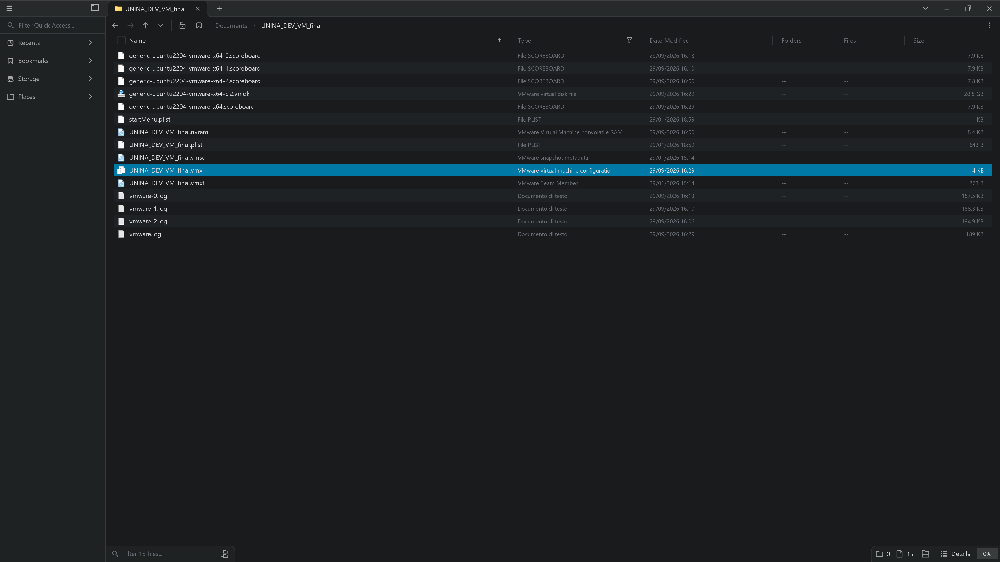
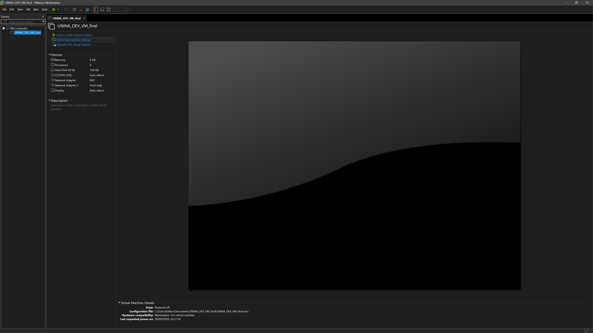
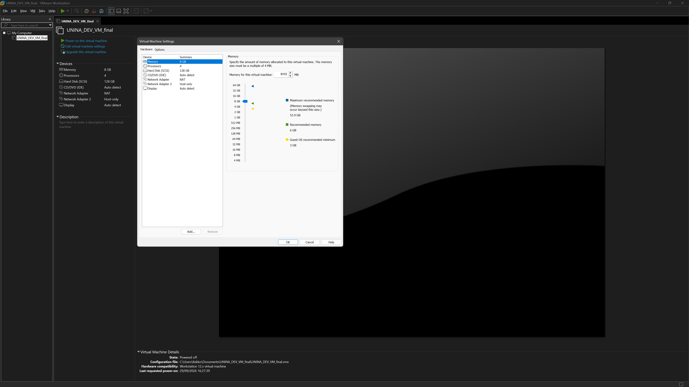
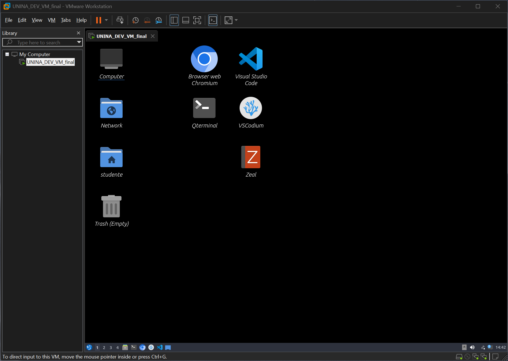

# Istruzioni per uso della macchina virtuale a supporto della parte esercitativa del corso di Sistemi Operativi

###### Docenti: Domenico Cotroneo, Marcello Cinque, Luigi De Simone, Roberto Natella, Cristina Improta

> **_N.B.:_** Per poter eseguire una macchina virtuale è necessario abilitare le estensioni di virtualizzazione della macchina fisica. Queste estensioni vanno abilitate dal BIOS all'avvio della macchina. Seguire una guida qualsiasi in base al modello del PC.

La macchina virtuale è **già pronta all'uso**: non va installato nessun sistema operativo, basta scaricarla e avviarla. Contiene **Ubuntu 22.04 LTS** con i principali pacchetti software utili per il corso (shell, compilatore, etc.). L'username e password dell'utente di default sono rispettivamente **studente** e **studente**.

## Quale macchina scaricare

La scelta dipende dal processore del proprio computer:

| Computer | Macchina virtuale | Programma di virtualizzazione |
| --- | --- | --- |
| Windows o Linux (processore Intel/AMD, x86) | [UNINA_DEV_VM_final.zip](https://communitystudentiunina-my.sharepoint.com/:u:/g/personal/luigi_desimone_unina_it/IQAwVDye4BfLS52EzhDo4j08AcrvyAskAPJQXEX8yJ41guU?e=I3GaF1&isSPOFile=1&xsdata=MDV8MDJ8fGRmYzIxMzE1YzEyMTRmN2ZlY2Q2MDhkZjFkNzU3YmYxfDJmY2ZlMjZhYmI2MjQ2YjBiMWUzMjhmOWRhMGM0NWZkfDB8MHw2MzkyNjIwNjI1Mzc3MzEyODZ8VW5rbm93bnxWR1ZoYlhOVFpXTjFjbWwwZVZObGNuWnBZMlY4ZXlKRFFTSTZJbFJsWVcxelgwRlVVRk5sY25acFkyVmZVMUJQVEU5R0lpd2lWaUk2SWpBdU1DNHdNREF3SWl3aVVDSTZJbGRwYmpNeUlpd2lRVTRpT2lKUGRHaGxjaUlzSWxkVUlqb3hNWDA9fDF8TDJOb1lYUnpMekU1T2pVMU16azNNemxrTFdVMlpXSXROREptWWkwNFpUZG1MVEJoTVdJMllXSTRObUl5Wmw5bFpUY3pNVFpoT0MwelpEWmtMVFF6WkdZdFltWmhOaTB4WkdZNU5UUTNOek5sWVRsQWRXNXhMbWRpYkM1emNHRmpaWE12YldWemMyRm5aWE12TVRjNU1EWXdPVFExTWpVMU1BPT18N2Y2Y2Y0NzQ0YjA5NGMyOThhNmIwOGRmMWQ3NTdiZWZ8ZGMzM2I5NjZiZGE4NGFmMzg5YTQyOTNjYzdjYWEwMDU%3D&sdata=WGZBRVd5VE16NGNtNW1YYkhWMzNUaDRhc1hRWER6SWtyN2xJMm4vdHdhaz0%3D&ovuser=2fcfe26a-bb62-46b0-b1e3-28f9da0c45fd%2Cfrancesco.boccola%40unina.it) (x86) | **VMware Workstation** (Windows, Linux) oppure **VMware Fusion** (Mac con processore Intel) |
| Mac con processore Apple Silicon (M1, M2, ...) | [UNINA_DEV_VM.utm.zip](https://communitystudentiunina-my.sharepoint.com/:u:/g/personal/raffaele_dellacorte2_unina_it/IQCYc9F1KWkJT7c2726Jp1RlAXaIqE74HXe9f2FQ-eKxyVA?isSPOFile=1&xsdata=MDV8MDJ8fGRmYzIxMzE1YzEyMTRmN2ZlY2Q2MDhkZjFkNzU3YmYxfDJmY2ZlMjZhYmI2MjQ2YjBiMWUzMjhmOWRhMGM0NWZkfDB8MHw2MzkyNjIwNjI1Mzc3MzEyODZ8VW5rbm93bnxWR1ZoYlhOVFpXTjFjbWwwZVZObGNuWnBZMlY4ZXlKRFFTSTZJbFJsWVcxelgwRlVVRk5sY25acFkyVmZVMUJQVEU5R0lpd2lWaUk2SWpBdU1DNHdNREF3SWl3aVVDSTZJbGRwYmpNeUlpd2lRVTRpT2lKUGRHaGxjaUlzSWxkVUlqb3hNWDA9fDF8TDJOb1lYUnpMekU1T2pVMU16azNNemxrTFdVMlpXSXROREptWWkwNFpUZG1MVEJoTVdJMllXSTRObUl5Wmw5bFpUY3pNVFpoT0MwelpEWmtMVFF6WkdZdFltWmhOaTB4WkdZNU5UUTNOek5sWVRsQWRXNXhMbWRpYkM1emNHRmpaWE12YldWemMyRm5aWE12TVRjNU1EWXdPVFExTWpVMU1BPT18N2Y2Y2Y0NzQ0YjA5NGMyOThhNmIwOGRmMWQ3NTdiZWZ8ZGMzM2I5NjZiZGE4NGFmMzg5YTQyOTNjYzdjYWEwMDU%3D&sdata=a1hibm85RGk1bDRzZmFmMlQ4NnA4UTloeUlJYXVCYzc0UjdJVDBuZVhmVT0%3D&ovuser=2fcfe26a-bb62-46b0-b1e3-28f9da0c45fd%2Cfrancesco.boccola%40unina.it) (ARM) | **UTM** |

> **_N.B.:_** Il file da scaricare è molto grande (decine di GB una volta decompresso): verificare di avere spazio libero sufficiente sul disco prima di iniziare.

## Windows, Linux e Mac Intel: VMware

### 1. Installare VMware

Scaricare e installare gratuitamente **VMware Workstation** (Windows e Linux) oppure **VMware Fusion** (Mac) da questo link:
[https://www.vmware.com/products/desktop-hypervisor/workstation-and-fusion](https://www.vmware.com/products/desktop-hypervisor/workstation-and-fusion)

### 2. Scaricare e decomprimere la macchina virtuale

Scaricare il file **UNINA_DEV_VM_final.zip** dal link nella tabella precedente e **decomprimerlo** in una cartella a scelta. Si otterrà una cartella `UNINA_DEV_VM_final` contenente, tra gli altri, il file **UNINA_DEV_VM_final.vmx**.

<!-- PLACEHOLDER SCREENSHOT 1: Esplora file (Windows) con la cartella UNINA_DEV_VM_final decompressa aperta, file UNINA_DEV_VM_final.vmx evidenziato -->

### 3. Aprire la macchina virtuale

Aprire il file **UNINA_DEV_VM_final.vmx** con VMware (doppio click sul file, oppure dal menu **File -> Open...** di VMware). Non serve importare né convertire nulla: la macchina virtuale apparirà direttamente nella libreria di VMware.

<!-- PLACEHOLDER SCREENSHOT 2: VMware Workstation con la VM UNINA_DEV_VM_final visibile nella libreria (colonna a sinistra) e la scheda della VM aperta, con i pulsanti "Power on this virtual machine" e "Edit virtual machine settings" ben visibili -->

### 4. (Opzionale) Personalizzare l'hardware virtuale

Per default la macchina virtuale usa **4 GB di memoria RAM** e **4 CPU virtuali**. Se il proprio computer ha poche risorse (o, al contrario, ne ha in abbondanza) è possibile modificare questi valori prima dell'avvio, cliccando su **Edit virtual machine settings**. La raccomandazione è quella di avere almeno 2 CPU virtuali e almeno 2 GB di memoria RAM.

<!-- PLACEHOLDER SCREENSHOT 3: finestra "Virtual Machine Settings" (Hardware) con le voci Memory e Processors selezionabili/visibili -->

### 5. Avviare la macchina virtuale

Cliccare su **Power on this virtual machine** (pulsante di avvio). Al termine dell'avvio del sistema operativo, e della fase di login (utente: studente, password: studente), la macchina virtuale apparirà come segue:

<!-- PLACEHOLDER SCREENSHOT 4: desktop di Ubuntu della VM completamente avviata (dopo il login, magari con un terminale aperto) -->

## Mac con Apple Silicon (M1, M2, ...): UTM

1. Scaricare **UTM** da [https://mac.getutm.app](https://mac.getutm.app), cliccando su "download" per la versione gratuita, e installarlo.
2. Scaricare il file **UNINA_DEV_VM.utm.zip** dal link nella tabella precedente e **decomprimerlo**. Si otterrà il file **ACPM1.utm**.
3. Aprire UTM, cliccare su **Create a New Virtual Machine** e poi su **Open**, quindi selezionare il file **ACPM1.utm** appena decompresso.
4. Selezionare la macchina virtuale nell'elenco a sinistra e avviarla con il pulsante di **play**.

## Uso della macchina virtuale

> **_N.B.:_** Per effettuare operazioni di amministrazione (ad esempio, installazione di pacchetti, il comando sudo, etc.), se richiesta, si utilizzi la password ' **studente**' (nome utente: ' **studente**').
