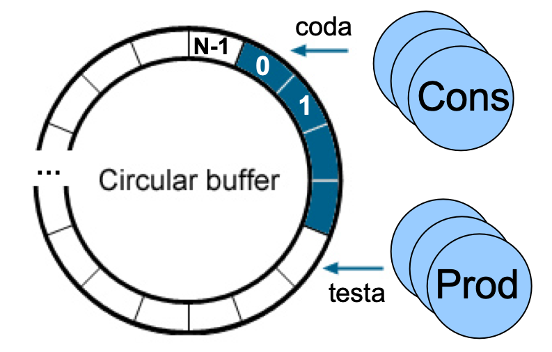

## Produttore-Consumatore con pool di buffer gestito come coda circolare

### Esercizio

*Scrivere un'applicazione concorrente che implementi il problema dei Produttori/Consumatori.
Il programma crei dei processi che agiscano da produttore e consumatore utilizzando un pool di buffer in cui sono memorizzati valori di tipo intero. Tale pool di buffer è gestito come coda circolare. Il pool di buffer è creato attraverso una shared memory POSIX (`shm_open`, `ftruncate`, `mmap`) e la sincronizzazione tra produttori e consumatori deve avvenire tramite l'utilizzo di semafori POSIX anonimi (`sem_init`, `sem_wait`, `sem_post`).*

I vincoli che caratterizzano il problema produttore-consumatore con pool di buffer sono gli stessi per il problema a singolo buffer, ovvero che un produttore non può produrre se non c'è spazio disponibile, mentre un consumatore non può consumare se non ci sono valori disponibili.

In particolare, si gestisce il pool di buffer come coda circolare, in cui si impone la produzione di un valore in testa alla coda e la consumazione in coda.

<p align="center">

</p>

Il pool di buffer, gestito come coda circolare, è implementato attraverso la seguente struttura dati:

```c
struct prodcons {
    int buffer[DIM_BUFFER];
    int testa;
    int coda;
    sem_t spazio_disponibile;
    sem_t messaggio_disponibile;
    sem_t mutex_p;
    sem_t mutex_c;
};
```

dove,

- ``buffer[DIM_BUFFER]``, l'array di elementi di tipo ``int``(tipo del messaggio depositato dai produttori) contenente i valori prodotti;

- ``testa`` di tipo intero. Si riferisce alla posizione del primo elemento libero in testa. In altre parole rappresenta il primo elemento disponibile per la memorizzazione del messaggio prodotto. L'elemento di testa è ``buffer[testa-1]``;

- ``coda`` di tipo intero. L'elemento puntato si riferisce alla posizione dell'elemento di coda alla coda circolare. In altre parole l'elemento di coda è ``buffer[coda]``, ed è il primo elemento da poter consumare da parte dei consumatori;

- i quattro campi di tipo ``sem_t``, i semafori POSIX anonimi (con `pshared` pari a 1) usati per la sincronizzazione.

La struttura ``prodcons`` è condivisa tra i processi produttori e consumatori tramite shared memory: in questo modo anche i semafori risiedono nella memoria condivisa.

Per la sincronizzazione dei processi produttore e consumatore si utilizzano due semafori:

- ``spazio_disponibile``, che indica la presenza di spazio disponibile in coda per la produzione di un messaggio. ``spazio_disponibile`` ha valore iniziale pari a ``DIM_BUFFER`` (dimensione della coda)

- ``messaggio_disponibile``, che indica il numero di messaggi presenti in coda. ``messaggio_disponibile`` ha valore iniziale pari a ``0``.

Questi 2 semafori sono sufficienti solo per gestire un solo produttore e un solo consumatore. Per gestire produttori e consumatori multipli bisogna utilizzare altri 2 semafori perchè le operazioni di deposito e prelievo devono essere eseguite rispettivamente in mutua esclusione, ed essere quindi programmate come sezioni critiche.

I due nuovi semafori sono:

- ``mutex_c`` per gestire la competizione per le operazioni di consumo;
- ``mutex_p`` per gestire la competizione per le operazioni di produzione.

Entrambi i semafori sono inizializzati a ``1``. Si noti che si usano **due mutex separati**: i produttori competono solo tra loro sull'indice ``testa``, i consumatori solo tra loro sull'indice ``coda``, quindi un produttore e un consumatore possono operare in parallelo.

La produzione ed il consumo avvengono rispettivamente all'interno delle procedure:

```c
void produttore(struct prodcons *);
void consumatore(struct prodcons *);
```

dove l'argomento è un puntatore alla struttura che gestisce la coda circolare memorizzata nella shared memory creata: tramite esso le procedure accedono sia ai dati sia ai semafori, sui quali effettuano le operazioni di wait (i.e., ``sem_wait``) e signal (i.e., ``sem_post``) necessarie per la cooperazione e competizione tra produttore e consumatore.
Il valore prodotto è un intero generato tramite la funzione ``rand()``.

Analizzare il file [procedure.c](procedure.c) in cui vengono implementate le funzioni di produzione e consumazione, e il file [prodcons_coda_circolare.c](prodcons_coda_circolare.c) dove vengono inizializzati i semafori necessari (e, al termine, distrutti con `sem_destroy`, `munmap` e `shm_unlink`).
Compilare ed eseguire il codice:

```console
$ make
$ ./prodcons_coda_circolare
Inizio figlio consumatore
Inizio figlio consumatore
Inizio figlio consumatore
Inizio figlio consumatore
Inizio figlio consumatore
Inizio figlio produttore
Inizio figlio produttore
Inizio figlio produttore
Inizio figlio produttore
Inizio figlio produttore
Il valore prodotto = 23
Il valore prodotto = 41
Il valore prodotto = 38
Figlio produttore terminato
Figlio produttore terminato
Figlio produttore terminato
Il valore consumato = 23
Il valore consumato = 41
Il valore consumato = 38
Figlio produttore terminato
Figlio produttore terminato
Figlio consumatore terminato
Il valore prodotto = 35
Il valore prodotto = 20
Figlio consumatore terminato
Figlio consumatore terminato
Il valore consumato = 35
Figlio consumatore terminato
Il valore consumato = 20
Figlio consumatore terminato
```
