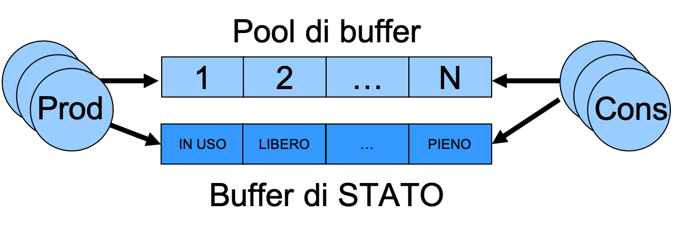

## Produttore-Consumatore con pool di buffer gestito con vettore di stato

### Esercizio

*Scrivere un'applicazione concorrente che implementi il problema dei Produttori/Consumatori.
Il programma crei dei processi che agiscano da produttore e consumatore utilizzando un pool di buffer in cui sono memorizzati valori di tipo intero. Tale pool di buffer deve essere gestito con vettore di stato. Il pool di buffer è creato attraverso una shared memory POSIX (`shm_open`, `ftruncate`, `mmap`) e la sincronizzazione tra produttori e consumatori deve avvenire tramite l'utilizzo di semafori POSIX anonimi (`sem_init`, `sem_wait`, `sem_post`).*

La soluzione con pool di buffer gestito come coda circolare può penalizzare produttori o consumatori veloci in presenza di produttori o consumatori lenti. Questo può accadere, ad esempio, quando i messaggi prodotti hanno dimensione variabile.

I vincoli che caratterizzano il problema produttore-consumatore con pool di buffer con vettore di stato sono gli stessi per il problema a singolo buffer, ovvero che un produttore non può produrre se non c'è spazio disponibile, mentre un consumatore non può consumare se non ci sono valori disponibili.

In questo caso però, ci si avvale di un **vettore di stato** ausiliare per acquisire il lasciapassare a produrre o consumare una specifica locazione del pool di buffer in maniera concorrente.
L'accesso a tale vettore di stato è in mutua esclusione, e dopo aver acquisito un buffer del pool, produttori e consumatori procedono in concorrenza.


<p align="center">

</p>

Il pool di buffer e il vettore di stato sono implementati attraverso la seguente struttura dati:

```c
struct prodcons {
    int buffer[DIM_BUFFER];
    int stato[DIM_BUFFER];
    sem_t spazio_disponibile;
    sem_t messaggio_disponibile;
    sem_t mutex_p;
    sem_t mutex_c;
};
```

dove,

- ``buffer[DIM_BUFFER]``, un array di elementi di tipo ``int``(tipo del messaggio depositato dai produttori) contenente i valori prodotti;

- ``stato[DIM_BUFFER]``, un array di elementi di tipo intero. Il valore i-esimo, ``stato[i]``, può assumere i seguenti tre valori:
	- ``BUFFER_VUOTO`` – la cella ``buffer[i]`` non contiene alcun valore prodotto;
	- ``BUFFER_PIENO`` – la cella ``buffer[i]`` contiene un valore prodotto e non ancora consumato;
	- ``BUFFER_INUSO`` – il valore della cella ``buffer[i]`` contiene un valore in uso da un processo attivo, consumatore o produttore.

- i quattro campi di tipo ``sem_t``, i semafori POSIX anonimi (con `pshared` pari a 1) usati per la sincronizzazione.

Inizialmente ogni elemento del vettore ``stato[DIM_BUFFER]`` deve essere inizializzato a ``BUFFER_VUOTO``.

La struttura ``prodcons`` è condivisa tra i processi produttori e consumatori tramite shared memory: in questo modo anche i semafori risiedono nella memoria condivisa.

Come per il problema con coda circolare, per la sincronizzazione dei processi produttore e consumatore si utilizzano quattro semafori:

- ``spazio_disponibile``, che indica la presenza di spazio disponibile in coda per la produzione di un messaggio. ``spazio_disponibile`` ha valore iniziale pari a ``DIM_BUFFER`` (dimensione della coda)

- ``messaggio_disponibile``, che indica il numero di messaggi presenti in coda. ``messaggio_disponibile`` ha valore iniziale pari a ``0``.

- ``mutex_c`` per gestire la competizione per le operazioni di consumo, inizializzato a ``1``.
- ``mutex_p`` per gestire la competizione per le operazioni di produzione, inizializzato a ``1``.

Il punto chiave della soluzione è che il mutex protegge **solo** la ricerca della cella e la marcatura a ``BUFFER_INUSO``: subito dopo il mutex viene rilasciato, e la produzione (o il consumo) vera e propria avviene **fuori** dalla sezione critica, in concorrenza con gli altri processi. Al termine la cella viene marcata ``BUFFER_PIENO`` (o ``BUFFER_VUOTO``) e viene segnalato il semaforo di cooperazione.

La produzione ed il consumo avvengono rispettivamente all'interno delle procedure:

```c
void produttore(struct prodcons *);
void consumatore(struct prodcons *);
```

dove l'argomento è un puntatore alla struttura che gestisce il pool di buffer e il vettore di stato memorizzati nella shared memory creata: tramite esso le procedure accedono sia ai dati sia ai semafori, sui quali effettuano le operazioni di wait (i.e., ``sem_wait``) e signal (i.e., ``sem_post``) necessarie per la cooperazione e competizione tra produttore e consumatore.
Il valore prodotto è un intero generato tramite la funzione ``rand()``.

Analizzare il file [procedure.c](procedure.c) in cui vengono implementate le funzioni di produzione e consumazione, e il file [prodcons_vettore_stato.c](prodcons_vettore_stato.c) dove vengono inizializzati i semafori necessari (e, al termine, distrutti con `sem_destroy`, `munmap` e `shm_unlink`).
Compilare ed eseguire il codice:

```console
$ make
$ ./prodcons_vettore_stato
Inizio figlio consumatore
Inizio figlio consumatore
Inizio figlio consumatore
Inizio figlio consumatore
Inizio figlio consumatore
Inizio figlio produttore
Inizio figlio produttore
Inizio figlio produttore
Inizio figlio produttore
Inizio figlio produttore
Il valore prodotto = 16
Figlio produttore terminato
Il valore prodotto = 37
Il valore consumato = 16
Figlio produttore terminato
Figlio produttore terminato
Il valore consumato = 37
Il valore prodotto = 97
Figlio produttore terminato
Figlio produttore terminato
Il valore consumato = 97
Il valore prodotto = 39
Figlio consumatore terminato
Figlio consumatore terminato
Il valore consumato = 39
Il valore prodotto = 18
Figlio consumatore terminato
Figlio consumatore terminato
Il valore consumato = 18
Figlio consumatore terminato
```
