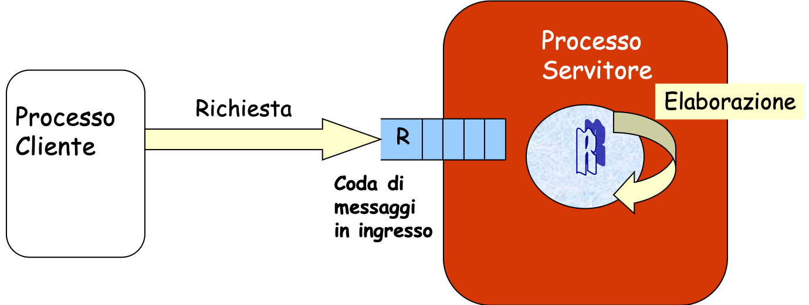

# Coda di messaggi

Linux mette a disposizione primitive che supportano la comunicazione fra processi (anche indipendenti) basata sullo **scambio di messaggi**. Un **messaggio** è identificato come un blocco di informazioni senza alcun formato predefinito.

In particolare, lo standard **POSIX** (estensioni real-time, POSIX.1b) supporta il modello nel quale lo scambio di messaggi non avviene direttamente tra il mittente e il destinatario, ma avviene tra un utente e una **mailbox** (comunicazione indiretta).

<p align="center">

</p>

Le code di messaggi POSIX mettono a disposizione primitive di **send asincrona** (bloccante solo a coda piena), di **receive bloccante**, e **receive non bloccante**; in più, rispetto ad altre implementazioni, offrono **priorità** dei messaggi, ricezioni e invii **temporizzati** (`mq_timedsend`/`mq_timedreceive`) e la **notifica asincrona** (`mq_notify`).

Una mailbox può essere vista come una *coda di messaggi*. Essa è caratterizzata da:

- Un **nome**, cioè una stringa che inizia con `/` (ad esempio `/miacoda`), al posto delle chiavi numeriche usate da altre famiglie di IPC;
- Un proprietario, ovvero l'utente che la istanzia;
- Un gruppo di appartenenza;
- Un insieme di permessi di accesso, indicati dalla solita stringa di 3 numeri a 3 bit;
- Un insieme di **attributi** (`struct mq_attr`): numero massimo di messaggi e dimensione massima del singolo messaggio.

Le code POSIX sono visibili come file nel filesystem virtuale `/dev/mqueue`: dopo averne creata una si può osservare con `ls /dev/mqueue`, e rimuoverla anche da shell con `rm /dev/mqueue/<nome>` (senza lo `/` iniziale del nome).

### Operazioni su code di messaggi

#### Creazione/apertura di una coda di messaggi: ``mq_open()``

Per creare una nuova coda di messaggi, o accedere ad una esistente, bisogna invocare la funzione ``mq_open()``.

```c
#include <fcntl.h>      /* Costanti O_* */
#include <sys/stat.h>   /* Permessi */
#include <mqueue.h>

mqd_t mq_open(const char *name, int oflag);
mqd_t mq_open(const char *name, int oflag, mode_t mode, struct mq_attr *attr);
```

La funzione restituisce il descrittore della coda (di tipo ``mqd_t``) a partire dal nome ``name``, oppure ``(mqd_t) -1`` in caso di esito negativo. Il parametro ``oflag`` indica la modalità di apertura, con le stesse costanti usate per i file:

- ``O_RDONLY``, ``O_WRONLY``, ``O_RDWR``: apertura in sola lettura, sola scrittura, lettura/scrittura;
- ``O_CREAT``: crea la coda se non esiste (richiede anche ``mode`` e ``attr``);
- ``O_CREAT | O_EXCL``: fallisce (con ``errno == EEXIST``) se la coda esiste già, utile per distinguere il creatore;
- ``O_NONBLOCK``: le successive ``mq_send``/``mq_receive`` non si bloccano mai e falliscono con ``errno == EAGAIN``.

Gli attributi della coda vengono fissati alla creazione tramite la struttura ``mq_attr``:

```c
struct mq_attr {
    long mq_flags;    /* 0 oppure O_NONBLOCK (ignorato da mq_open) */
    long mq_maxmsg;   /* numero massimo di messaggi in coda */
    long mq_msgsize;  /* dimensione massima del messaggio (byte) */
    long mq_curmsgs;  /* n. di messaggi attualmente in coda (ignorato da mq_open) */
};
```

Passando ``attr == NULL`` vengono usati i valori di default del sistema (visibili in ``/proc/sys/fs/mqueue/``).

Assumendo di avere la funzione ``open_queue``, la sua implementazione per creare una coda di messaggi è la seguente:

```c
mqd_t open_queue(const char *name) {
    struct mq_attr attr;
    attr.mq_flags = 0;
    attr.mq_maxmsg = 10;                  /* al piu' 10 messaggi in coda */
    attr.mq_msgsize = sizeof(Messaggio);  /* dimensione di ogni messaggio */
    attr.mq_curmsgs = 0;

    mqd_t mqd = mq_open(name, O_RDWR | O_CREAT, 0664, &attr);
    if (mqd == (mqd_t)-1) {
        perror("mq_open");
        exit(1);
    }
    return mqd;
}
```

#### Invio di un messaggio: ``mq_send()``

```c
#include <mqueue.h>

int mq_send(mqd_t mqdes, const char *msg_ptr, size_t msg_len, unsigned msg_prio);
```

Invia (con accodamento) il messaggio puntato da ``msg_ptr``, lungo ``msg_len`` byte (deve essere ``<= mq_msgsize``), sulla coda ``mqdes``. Restituisce ``0`` in caso di successo, ``-1`` in caso di errore.

La send è **asincrona**: il mittente non attende il destinatario, e si sospende soltanto se la coda è piena (cioè contiene già ``mq_maxmsg`` messaggi). Se la coda è stata aperta con ``O_NONBLOCK``, in tal caso la funzione ritorna subito ``-1`` con ``errno == EAGAIN``.

A differenza di altre famiglie di code, **non esiste alcun campo "tipo"** da inserire nel messaggio: il contenuto è un semplice vettore di byte (tipicamente una struttura definita dal programmatore, inviata con ``sizeof(struttura)``). Al suo posto c'è la **priorità** ``msg_prio`` (da ``0`` a ``MQ_PRIO_MAX-1``): i messaggi sono consegnati in ordine di priorità decrescente e, a parità di priorità, in ordine FIFO. Se le priorità non interessano, si usa ``0`` per tutti i messaggi (ordine FIFO puro).

#### Ricezione di un messaggio: ``mq_receive()``

```c
#include <mqueue.h>

ssize_t mq_receive(mqd_t mqdes, char *msg_ptr, size_t msg_len, unsigned *msg_prio);
```

Preleva dalla coda il messaggio **più vecchio a priorità più alta**, copiandolo in ``msg_ptr``. Restituisce la lunghezza del messaggio ricevuto, oppure ``-1`` in caso di errore.

**Attenzione:** il buffer di ricezione deve essere grande **almeno** ``mq_msgsize`` byte (l'attributo della coda), altrimenti la chiamata fallisce con ``errno == EMSGSIZE``. Il parametro ``msg_prio``, se non nullo, riceve la priorità del messaggio; se non interessa si può passare ``NULL``.

La receive è **bloccante**: se la coda è vuota il processo si sospende fino all'arrivo di un messaggio. Con ``O_NONBLOCK`` la funzione ritorna invece subito ``-1`` con ``errno == EAGAIN`` (**receive non bloccante**).

Non esiste la ricezione selettiva per tipo: quando un processo deve ricevere solo "i propri" messaggi (ad esempio le risposte di un server), si usa una **coda di risposta dedicata** per ogni destinatario, oppure si sfruttano le priorità.

#### Lettura degli attributi: ``mq_getattr()``

```c
#include <mqueue.h>

int mq_getattr(mqd_t mqdes, struct mq_attr *attr);
```

Recupera gli attributi correnti della coda; in particolare ``attr->mq_curmsgs`` contiene il numero di messaggi attualmente presenti. Con ``mq_setattr`` è possibile modificare a runtime soltanto il flag ``O_NONBLOCK``.

#### Chiusura e rimozione: ``mq_close()`` e ``mq_unlink()``

```c
#include <mqueue.h>

int mq_close(mqd_t mqdes);
int mq_unlink(const char *name);
```

``mq_close`` chiude il descrittore del processo chiamante (avviene comunque automaticamente alla terminazione). ``mq_unlink`` rimuove il **nome** della coda dal sistema: la coda viene effettivamente deallocata quando tutti i processi che la tenevano aperta hanno invocato ``mq_close`` (o sono terminati). Come per tutte le risorse POSIX nominate, senza una ``mq_unlink`` esplicita la coda **persiste** anche dopo la terminazione dei processi.

### Compilazione

Le code di messaggi POSIX richiedono il linking della libreria real-time:

```console
$ gcc -o programma programma.c -lrt
```

### Errori comuni

- **Buffer di ricezione troppo piccolo**: ``mq_receive`` con ``msg_len < mq_msgsize`` fallisce con ``EMSGSIZE``; dimensionare sempre il buffer sull'attributo della coda.
- **Attributi incompatibili tra processi**: se due programmi aprono la stessa coda con ``mq_attr`` diversi, valgono gli attributi fissati dal creatore; conviene condividere la definizione in un header comune.
- **Nome senza ``/`` iniziale**: i nomi delle code devono iniziare con ``/`` e non contenere altri ``/``.
- **Coda non rimossa**: dimenticare ``mq_unlink`` lascia la coda nel sistema (verificare con ``ls /dev/mqueue``), e una successiva ``mq_open O_CREAT`` riutilizzerà la vecchia coda con i vecchi attributi e gli eventuali messaggi residui.
- **Limiti di sistema**: i valori massimi di ``mq_maxmsg`` e ``mq_msgsize`` per utenti non privilegiati sono limitati (si vedano ``/proc/sys/fs/mqueue/msg_max`` e ``/proc/sys/fs/mqueue/msgsize_max``).
