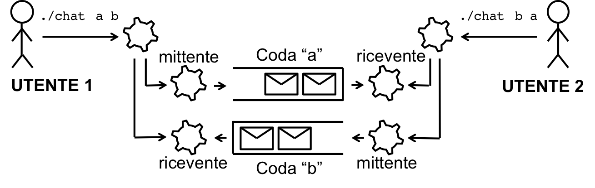

### Chat multiprocesso tramite code di messaggi

Si realizzi in linguaggio C/C++ un programma basato su code di messaggi POSIX per consentire la conversazione tra utenti del sistema. Il programma deve essere un eseguibile che due utenti (su due terminali distinti) eseguono per poter conversare. Il programma deve accettare in ingresso dalla linea di comando i **nomi delle due code POSIX** da usare per la conversazione (ad esempio `/chat_AB` e `/chat_BA`): la prima coda è quella su cui il programma invia, la seconda quella da cui riceve[1]. Il programma dovrà istanziare una coppia di processi figli, un mittente e un ricevente:
- Il processo figlio mittente eseguirà un loop in cui ad ogni iterazione si mette in attesa di una stringa dall'utente dallo standard input[2], ed invia un messaggio con la stringa sulla prima coda di messaggi (`mq_send`). Quando l'utente inserisce "exit" seguito da un carattere di invio, il programma deve inviare un messaggio con una stringa "exit" e terminare.
- Il processo figlio ricevente eseguirà un loop in cui ad ogni iterazione si metterà in attesa di un messaggio dalla seconda coda (`mq_receive` bloccante), e stamperà sullo standard output la stringa ricevuta. In caso di ricezione di un messaggio con la stringa "exit", il processo dovrà terminare. Si verifichi la correttezza del programma simulando 2 coppie di utenti che conversano, avviando 2 coppie di istanze del programma su 4 terminali diversi.

[1]: In altri termini, i due utenti di una conversazione devono passare gli stessi due nomi in ordine invertito (il primo utente `/chat_AB /chat_BA`, il secondo `/chat_BA /chat_AB`): la coda su cui uno invia è quella da cui l'altro riceve. Coppie di utenti diverse useranno nomi diversi e non potranno interferire tra loro. Si ricordi che ogni coda va creata con `mq_open(..., O_CREAT, ...)` fissandone gli attributi, e che al termine della conversazione le code vanno rimosse con `mq_unlink`.

[2]: Si utilizzi la funzione scanf() per leggere una stringa dallo standard input.
